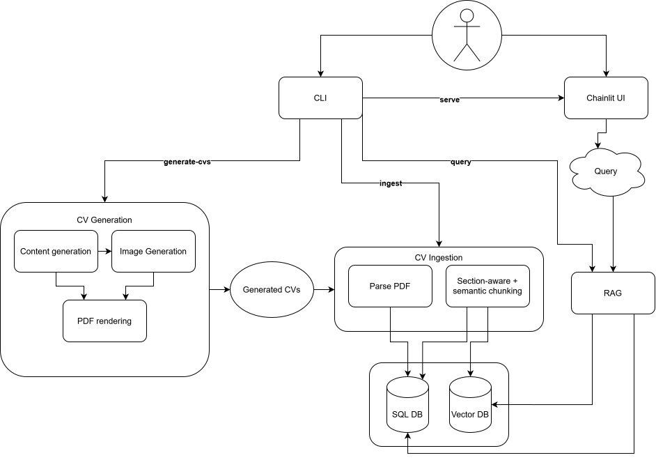
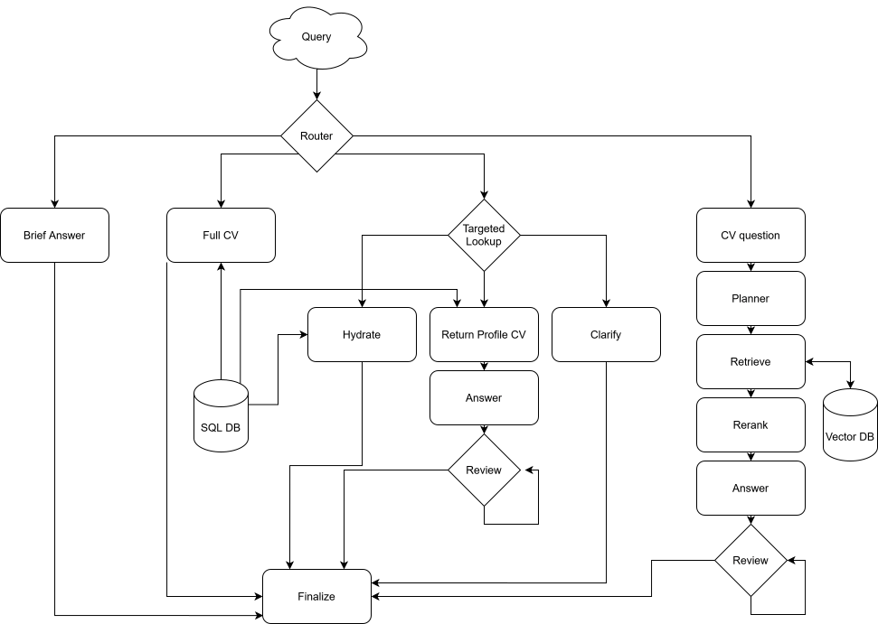

# CV Screener

Local-first CV screening app for a technical challenge.

The repo generates fake candidate profiles, renders them as PDFs, ingests the PDFs into a hybrid retrieval pipeline, and exposes a chat interface for recruiter-style questions. Answers are expected to stay grounded in CV content and include citations.

## What Is In The Repo

- YAML CV generation and validation
- PDF rendering with Jinja2 and WeasyPrint
- PDF parsing and chunking
- Hybrid retrieval over Qdrant + BM25
- LangGraph-based RAG runtime
- Typer CLI for generation, ingestion, querying, and serving
- Chainlit UI for interactive chat

## Architecture

Overview diagram placeholder:



RAG runtime diagram placeholder:



For a little more detail:

- [Local deployment and setup](docs/deployment.md)
- [Repo usage and workflow](docs/usage.md)
- [Architecture notes](docs/architecture.md)

## Local Deployment

1. Install Python 3.12, `uv`, Docker, and Docker Compose.
2. Copy `.env.example` to `.env`.
3. Install Python dependencies:

```bash
uv sync --dev
```

4. Start the local services used by the app:

```bash
docker compose up -d sqlite-init qdrant ollama
```

5. Pull the default Ollama model used by generation and RAG:

```bash
docker compose --profile setup up ollama-pull-models
```

The included compose setup is for local infrastructure. The application itself runs from the workspace through `uv run`.

## Quick Use

Generate a small local dataset first:

```bash
uv run cv-screener generate-cvs --count 3
```

Build the retrieval index:

```bash
uv run cv-screener ingest --reset
```

Query from the CLI:

```bash
uv run cv-screener query "Who has Python experience?"
```

Run the chat UI:

```bash
uv run cv-screener serve
```

Then open `http://127.0.0.1:8000/chainlit`.

## Main Commands

```bash
uv run cv-screener generate-content --count 3
uv run cv-screener generate-cvs --count 3
uv run cv-screener generate-photos data/cvs_contents
uv run cv-screener validate data/cvs_contents
uv run cv-screener render data/cvs_contents
uv run cv-screener ingest --reset
uv run cv-screener query "Who has Python experience?"
uv run cv-screener serve
```

## Notes

- Default model access is OpenAI-compatible and points to local Ollama.
- `docker-compose.yml` provisions Qdrant, Ollama, and SQLite volume initialization.
- The repo currently documents and exposes generation, ingestion, query, and UI flows.
